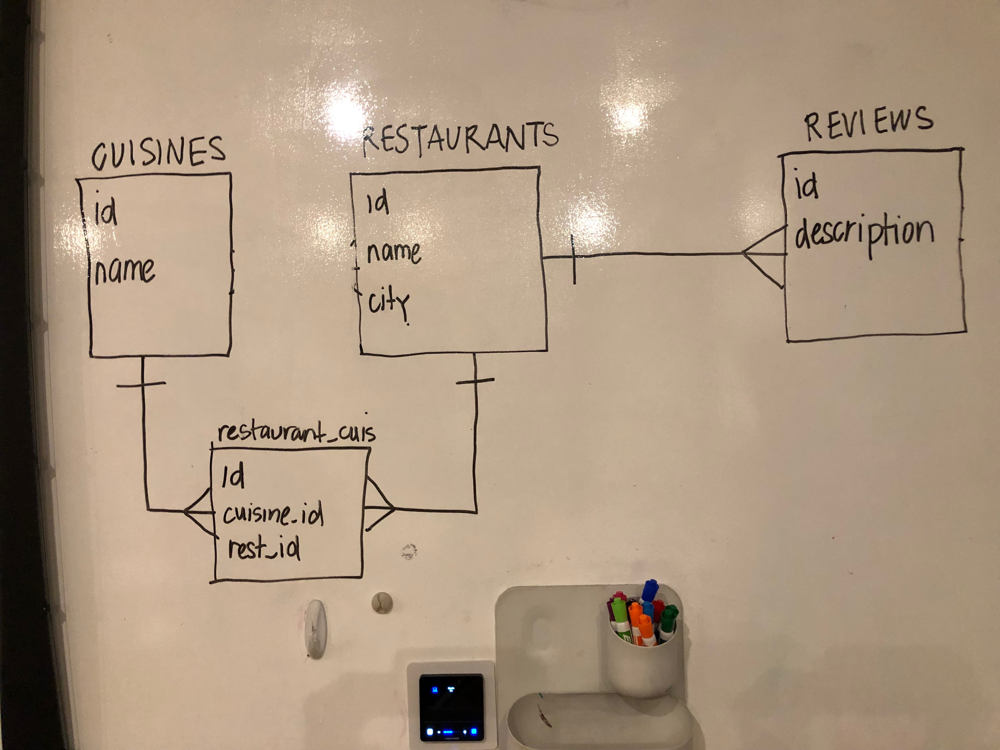

# Full Stack Restaurant App

## Learning Objectives

- Build a full stack web application that persists with a back-end
- Use [Sequelize](https://github.com/sequelize/sequelize) to interface with the back-end (Postgres database) **OR**
- Use the [axios](https://github.com/axios/axios) promise library to retrieve data from a back-end

## Project Build Out

We're going to be building this application from scratch!

> The code written in this lesson plan is meant to be used as a guide for your workflow. The error messages you'll get in Terminal and in the [Chrome Dev Tools]() are usually very accurate and helpful, so please utilize them. We should also note that some of the code snippets will be repetitions to reiterate points of learning. Some of them might just be updates to existing files. Some of them might be brand new content you have to add.

[Part 0: Setting Up the Database in Javascript](sprints/sprint0.md) 

[Part 1: Connecting the Server to the Database](sprints/sprint1.md)

[Part 2: Setting Up the RESTful Routes](sprints/sprint2.md)

[Part 3: Setting up the front end](sprints/sprint3.md)

## Project Setup

#### ERDs

## Bonus
