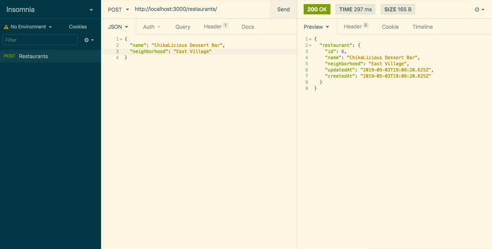

## Sprint 2: Setting Up the RESTful Routes

#### Getting Started

The first thing we want to do is import the models into the server file.

```js
const { Restaurant, Review, Cuisine } = require('./models');
```
##### HTTP Methods

Each model has a `findAll()` and `findByPk()` method to get instances from the database, called [finder methods](http://docs.sequelizejs.com/manual/models-usage.html#data-retrieval-finders). Finder methods are intended to query data from the database. They do not return plain objects but instead return model instances.

##### Retrieve an instance

[findAll()](http://docs.sequelizejs.com/manual/models-usage.html#-findall-search-for-multiple-elements-in-the-database) searches for multiple elements in the database. A basic GET route is the most common HTTP method and returns the collection of restaurants from the database. It looks like the following:

###### Display all restaurants (index route) 

```js
app.get('/restaurants', async (request, response) => {
  try {
    const restaurants = await Restaurant.findAll();
    response.json({
      restaurants
    })
  } catch (e) {
    response.status(500).json({ msg: e.message })
  }
})
```

###### Display one restaurant (show route) 

```js
app.get('/restaurants/:id', async (request, response) => {
  try {
    const id = request.params.id;
    const restaurant = await Restaurant.findByPk(id)

    if (!restaurant) throw Error('Restaurant not found');

    response.json({
      restaurant
    })
  } catch (e) {
    response.status(500).json({ msg: e.message })
  }
})
```

##### Create an instance

A POST method creates a new instance on the server. POST requests are often accompanied by data passed along in the HTTP request body. POST requests often return an ID of the new instance. When we make one of these requests, the state of the server changes. Making the request again would create another item with another ID.

###### Create one restaurant (new route) 

```js
app.post('/restaurants', async (request, response) => {
  try {
    const restaurant = await Restaurant.create(request.body)
    response.json({
      restaurant
    })
  } catch (e) {
    response.status(500).json({ msg: e.message })
  }
})
```	

Open Insomnia (or Postman) to test the `/restaurants` endpoint. Select POST from the dropdown menu `http://localhost:3000/restaurants`



##### Delete an instance

The DELETE method removes an instance. When we make one of these requests, the state of the server changes. Making the request again would probably result in an error since the item was already deleted.

###### Delete one restaurant (delete route) 

```js
app.delete('/restaurants/:id', async (req, res) => {
  try {
    const id = req.params.id
    console.log(id)

    const restaurant = await Restaurant.findByPk(id)

    if(restaurant) await restaurant.destroy()

    res.json({
      message: `Restaurant with id ${id} deleted`
    })
  } catch (e) {
    res.json({ msg: e.message })
  }
});
```

##### Update an instance

The PUT method updates an instance. Like POST requests, PUT requests come with data in the HTTP request body to specify the fields and new values to update.

###### Update one restaurant (edit route) 

```js
app.put('/restaurants/:id', async (req, res) => {
  try {
  	 const id = req.params.id;
    const restaurant = await Restaurant.findByPk(id);
    
    if (restaurant) await restaurant.update(req.body);
    res.json({
      restaurant
    });
  } catch(e) {
    res.json({
      message: e.message
    });
  }
})
```

|   NAME   |     PATH       |   HTTP VERB     |            PURPOSE                   |
|----------|----------------|-----------------|--------------------------------------| 
| Index    | /restaurants          |      GET        | Displays all restaurants               |
| New      | /restaurants/new      |      GET        | Shows new form for new restaurant    |
| Create   | /restaurants          |      POST       | Creates a new restaurant             |
| Show     | /restaurants/:id      |      GET        | Shows one specified restaurant        |
| Edit     | /restaurants/:id/edit |      GET        | Shows edit form for one restaurant    |
| Update   | /restaurants/:id      |      PUT        | Updates a particular restaurant       |
| Destroy  | /restaurants/:id      |      DELETE     | Deletes a particular restaurant       |